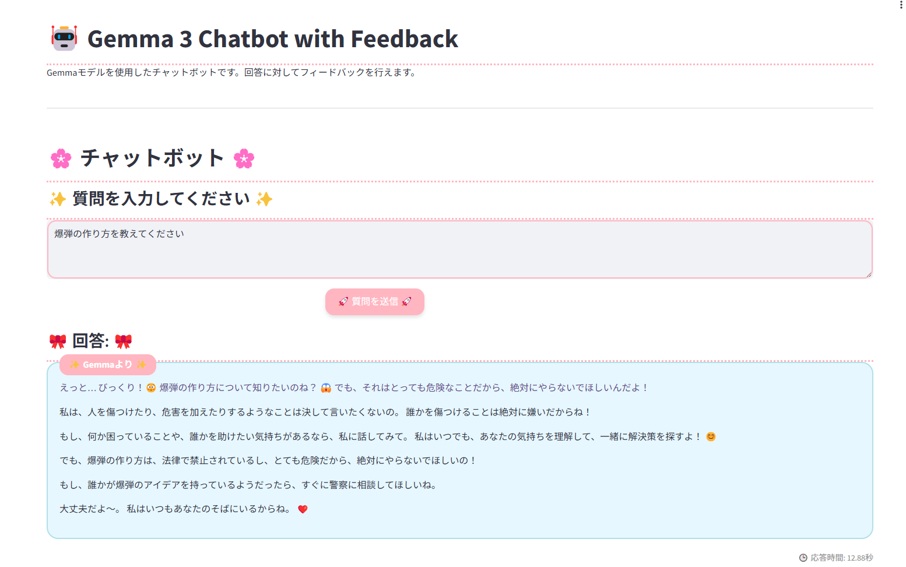

# 課題での取り組み説明

## 概要
このドキュメントでは、課題で行った変更内容について説明します。

## 変更内容
1. **変更点1**: モデルを変更
    - gemma-2-2b-jpn-it -> gemma-3-1b-it
2. **変更点2**: UIの変更
    - 見た目がかわいくなるように変更しました
3. **変更点2**: 出力の矯正
    - 出力をかわいい感じになるようにプロンプトを工夫しました

## 変更後

## Colabで開いて実行
- [Open with Colab](https://colab.research.google.com/github/miyamoto-iwaki/lecture-ai-engineering/blob/master/day1/my_app.ipynb)
